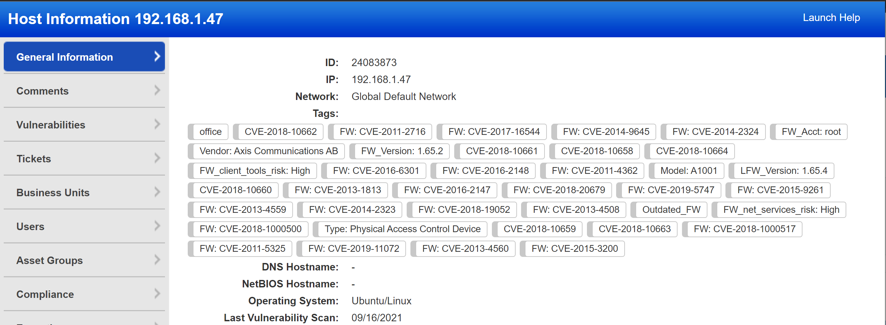

# Introduction
This repository hosts the [IoTVAS](https://firmalyzer.com/iotvas-api) connector app for [Qualys Cloud Platform](https://www.qualys.com/cloud-platform/). It enables Qualys users to:

* accurately identify IoT/connected devices and their vulnerabilities in the firmware code level
* track and manage discontinued, outdated and vulnerable devices from within the Qualys platform

For more infromation on this application, please visit [this blog post](https://firmalyzer.com/posts/iotvas_qualys_integration.html).

# Installation
Clone the repository content to a local folder and issue the following commands:
```
python3 -mvenv env
source env/bin/activate
pip install -r requirements.txt
```

# Configuration
The following parameters should be set in the config.py file before using the application:

1. Url to your Qualys Cloud Platform instance (qualys_api_base)
2. Username and password of your Qualys account that has permission to call asset management API (qualys_username, qualys_password)
3. Your IoTVAS Enterprise plan API key (iotvas_apikey). Trial keys can be obtained from [here](https://iotvas-api.firmalyzer.com/portal/signup)

# Usage
This application accepts a target list file and optional excluded addresses file. Both files can contain hostname, individual IP addresses or IP address ranges in CIDR notation.
```
(env) python iotvas-qualys.py -t targets.txt

```
|  | 
|:--:|
| *IoTVAS augments an PLC device in Qualys* |

The following video shows usage of this application:

[](https://www.youtube.com/watch?v=XossTJ9kPd0)
